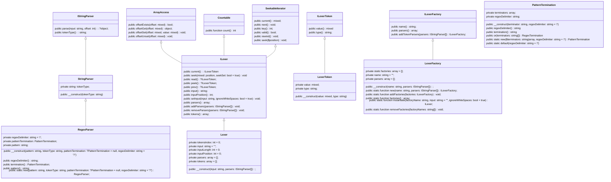

composer package: pst/lexical

namespace: PST\Lexical\Lexer

```mermaid

classDiagram
    graph TD

IStringParser <|-- StringParser
StringParser <|-- RegexParser

ArrayAccess <|-- ILexer
Countable <|-- ILexer
SeekableIterator <|-- ILexer

ILexer <|-- Lexer

ILexerToken <|-- LexerToken

ILexerFactory <|-- LexerFactory

class ArrayAccess {
    public offsetExists(offset: mixed) bool;
    public offsetGet(offset: mixed) object;
    public offsetSet(offset: mixed, value: mixed) void;
    public offsetUnset(offset: mixed) void;
}

class Countable {
    public function count() int
}

class SeekableIterator {
    public current() mixed;
    public next() void;
    public key() int;
    public valid() bool;
    public rewind() void;
    public seek($position) void;
}

class ILexer {
    public current(): ILexerToken
    public seek(mixed: position, seekSet: bool = true) void
    public read() ?ILexerToken;
    public peek() ?ILexerToken;
    public prev() ?ILexerToken;
    public input() string;
    public inputPosition() int;
    public setInput(input: string, ignoreWhiteSpaces: bool = true) void;
    public parsers() array;
    public addParsers(parsers: IStringParser[]) void;
    public removeParsers(parsers: IStringParser[]) void;
    public tokens() array;
}

class Lexer {
    private tokensIndex: int = 0;
    private input: string = "";
    private inputLength: int = 0;
    private inputPosition: int = 0;
    private parsers: array = [];
    private tokens: array = [];

    public __construct(input: string, parsers: IStringParser[]);
}

class ILexerToken {
    public value() mixed
    public type() string;
}

class LexerToken {
    private value: mixed;
    private type: string;

    public __construct(value: mixed, type: string)
}

class IStringParser {
    public parse(input: string, offset: int): ?object;
    public tokenType(): string;
}

class StringParser {
    private string: tokenType;

    public __construct(tokenType: string)
}

class RegexParser {
    private regexDelimiter: string = '/';
    private patternTermination: PatternTermination;
    private pattern: string;

    public __construct(pattern: string, tokenType: string, patternTermination: ?PatternTermination = null, regexDelimiter: string = "/")
    public regexDelimiter() string;
    public termination() PatternTermination;
    public pattern() string;

    public static new (pattern: string, tokenType: string, patternTermination: ?PatternTermination = null, regexDelimiter: string = "/") RegexParser;
}

class PatternTermination {
    private terminators: array;
    private regexDelimiter: string;

    public __construct(terminator: string, regexDelimiter: string = '/')
    public regexDelimiter() string
    public termination() string
    public or(terminators: string[]) RegexTermination

    public static new($terminators: string|array, regexDelimiter: string = '/') PatternTermination
    public static default(regexDelimiter: string = '/')
}

class ILexerFactory {
    public name() string;
    public parsers() array;
    public addTokenParsers(parsers: IStringParser[]) ILexerFactory;
}

class LexerFactory {
    private static factories: array = [];
    private name: string = "";
    private parsers: array = [];

    public __construct(name: string, parsers: IStringParser[]);
    
    public static function new(name: string, parsers: IStringParser[]) ILexerFactory;
    public static function addFactories(factories: ILexerFactory) void;
    public static function factories() array;
    public static function instantiate(factoryName: string, input: string = "", ignoreWhiteSpaces: bool = true) ILexer;
    public static function removeFactories(factoryNames: string[]) void;
}

```